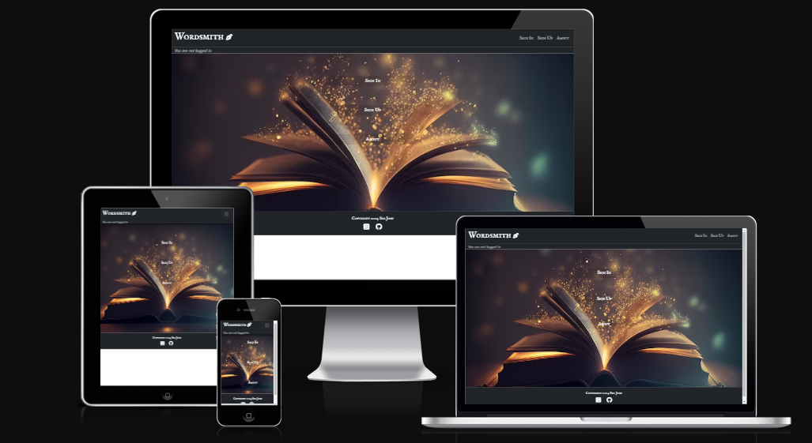

# Wordsmith

## Introduction
Wordsmith is a website built in Django using Python, JavaScript, CSS and HTML. It allows the user to share in the love of writing stories by giving them the opportunity to create their own short stories for others to read as well as read other short stories other users have posted.

They can give their story a heading, a blurb (content on the back of a book), a book cover and of course the content. You can edit your own stories as well as delete them if you wish.

[View the live website on Heroku](https://wordsmith-fafcef7f3870.herokuapp.com/)

## Table of Contents
* [User Experience Design (UX)](#UX)
    * [The Strategy Plane](#The-Strategy-Plane)
        * [Site Goals](#Site-Goals)
        * [Epics](#Epics)
        * [User Stories](#User-Stories)
    * [The Scope Plane](#The-Scope-Plane)
    * [The Structure Plane](#The-Structure-Plane)
        * [Opportunities](#Opportunities)
    * [The Skeleton Plane](#The-Skeleton-Plane)
        * [Wireframes](#Wireframe-mockups)
        * [Database Schema](#Database-Schema)
    * [The Surface Plane](#The-Surface-Plane)
* [Features](#features)
* [Future Enhancements](#future-enhancements)
* [Technologies Used](#technologies-used)
* [Testing](#testing)
* [Deployment](#deployment)
* [Credits](#credits)

## UX
### The Strategy Plane
*  Wordsmith is intended to be a site for users to create their own short stories for them to express themselves and share them for others to read. The user experience and design is to imply simplicity so that the users are not overloaded with information and get to the core of just creating, reading and enjoying the experience Wordsmith has to offer.

##### The Sites Ideal User
* A creative writer looking to share their own stories
* Someone who wants to enjoy reading short stories 
* A creative writer who wants to enjoy the art od story creation

#### Site Goals

* To provide users a place to create and edit their own stories for others to read
* To provide users a place to read other short stories

#### Epics

4 Epics were created which were then further developed into 18 User Stories. The details on each epic, along with the user stories linked to each one can be found in the project kanban board [here](https://github.com/users/SerJosh/projects/6/views/1)

1. Initial Django Setup [#1](https://github.com/SerJosh/wordsmith/issues/1)
2. User Account [#4](https://github.com/SerJosh/wordsmith/issues/4)
3. User Short Stories [#14](https://github.com/SerJosh/wordsmith/issues/14)
4. Enhancing website design [#19](https://github.com/SerJosh/wordsmith/issues/19)

### User Stories
From the Epics, 18 User stories were developed. Each story was assigned a classification of Must-have, Should-have or Could-have, I did not manage to produce any Wont-haves as I knew my time constraints and inexperience with Django would hinder me from completing any of them. Each story was also assigned user story points, based on my best estimation for the time/difficulty of completing each story. A combination of being new to story estimation, inexperience with Django and time constraints during development left me completing 31 story points from the initial total of 42. From the initial 42 story points, 8 were should-have and 8 were could-have. In an attempt to understand my scope, I did not create a vast amout of user stories initially but created essential Must-have stories to work on and after the completion of them developed some should-have or lower user stories to work with. The full list of User Stories, seperated by those completed and incompleted is available on the project [kanban board](https://github.com/users/SerJosh/projects/6/views/1).

1. Initial Django setup
	* USER STORY: Django Setup [#2](https://github.com/SerJosh/wordsmith/issues/2)
	* USER STORY: Early Deployment to Heroku [#3](https://github.com/SerJosh/wordsmith/issues/3)
	
2. User Account
	* USER STORY: Create a User Account [#5](https://github.com/SerJosh/wordsmith/issues/5)
	* USER STORY: Users must confirm their email [#6](https://github.com/SerJosh/wordsmith/issues/6)
	* USER STORY: Users can reset their password [#7](https://github.com/SerJosh/wordsmith/issues/7)
	* USER STORY: Users can view their profile [#8](https://github.com/SerJosh/wordsmith/issues/8)
	* USER STORY: Users can edit their profile [#9](https://github.com/SerJosh/wordsmith/issues/9)
	* USER STORY: Users can delete their account [#10](https://github.com/SerJosh/wordsmith/issues/10)
    * USER STORY: Users can change their password [#11](https://github.com/SerJosh/wordsmith/issues/11)
    * USER STORY: User Account Login / Logout [#12](https://github.com/SerJosh/wordsmith/issues/12)
    * USER STORY: Features restricted to signed in users [#13](https://github.com/SerJosh/wordsmith/issues/13) 

3.  USER Short Stories
	* USER STORY: Create a Short Story [#15](https://github.com/SerJosh/wordsmith/issues/15)
    * USER STORY: View short stories [#16](https://github.com/SerJosh/wordsmith/issues/16)
    * USER STORY: Edit a short story [#17](https://github.com/SerJosh/wordsmith/issues/17)
	* USER STORY: Delete a Short Story [#18](https://github.com/SerJosh/wordsmith/issues/18)

4.  Enhancing website design
	* USER STORY: Implementation of Responsive Design [#20](https://github.com/SerJosh/wordsmith/issues/20)
	* USER STORY: Utilise attractive fonts and colour scheme [#21](https://github.com/SerJosh/wordsmith/issues/21)
	* USER STORY: About page [#22](https://github.com/SerJosh/wordsmith/issues/22)

### The Scope Plane

**Features planned:**
* Stories - Users can create, read, update and delete their own stories
* Other Users Stories - Users can read other users stories
* Users can login to their account
* Users can reset their password if they forget it
* Users can logout of their account
* Users need to be registered and logged in to access story creation and read other stories
* Responsive Design - the site needs to be fully responsive to cover the wide variety of devices users may use to access Wordsmith

### The Structure Plane

User Story:

> Django Setup [#2](https://github.com/SerJosh/wordsmith/issues/2) - As a Developer, I want to set up Django and install the supporting libraries needed, so that I am ready to start development

Implementation:
* Install Django
* Install dj_database_url psycopg2
* Create a requirements.txt file
* Create the Django project – called wordsmith
* Create the first app, called stories and add it to the installed apps in the settings.py
* Create new instance in Postgres SQL and connect database to code

User Story:

> Early Deployment to Heroku [#3](https://github.com/SerJosh/wordsmith/issues/3) - As a Developer, I want to deploy the app to Heroku, so that I can confirm everything works before development of the site.

Implementation:
* Update code for deployment
* Create new Heroku app
* Connect Heroku to the PostgreSQL database
* Implement and add Secret Key to project and Heroku config var

User Story:

> Create a User Account [#5](https://github.com/SerJosh/wordsmith/issues/5) - As a user I would like to be able to create an account so that I can create and post short stories

Acceptance Criteria:
* Acceptance Criteria 1

Given that I am an unregistered user
When I am on the homepage
Then I can see a button to sign up
And, When I click on the button
Then I am taken to the user registration page

* Acceptance Criteria 2

Given that I am an unregistered user
And, I am on the user registration page
When I enter my username, email address and password
And, I click on the register button
Then The system creates me an account
And, signs me in

* Acceptance Criteria 3

Given that I have an account
And, I am signed into the account
When I have an option to write a short story
And, when I click on that option
Then I am taken to a page where I can write my short story

* Acceptance Criteria 4

Given that I am a registered user
When I am signed into my account
Then I do not see the register button 

Implementation:
* Install AllAuth
* Develop ability for users to register for a user account
* Develop a page and button in the nav bar to direct users to the registration page
* Remove the register button from the nav bar when users are logged in
* Create a User Registration form
* Create a button in the home page to create a short story directing to a create short story page

User Story:

> Users must confirm their email [#6](https://github.com/SerJosh/wordsmith/issues/6) - As a developer I can make users confirm their email so that I can keep my account secure

Acceptance Criteria:
* Acceptance Criteria 1

Given that a user wants to register
When they fill in the details in the registration page
Then they have to confirm their email

* Acceptance Criteria 2

Given that the user has confirmed their email
When they have confirmed it in their email
Then they will be able to access the site as a registered user

Implementation:
* Develop an automated email platform for users to receive email confirmations

* Include a link to the website to go back once they have confirmed

* Develop the ability to see confirmed users in the admin page

User Story:

> Users can reset their password [#7](https://github.com/SerJosh/wordsmith/issues/7) - As a user I can reset my password so that if I forget it I can still access my account

Acceptance Criteria:
* Acceptance Criteria 1

Given that I forgot by password
When I try to login with an incorrect password
Then an option is available to reset my password

* Acceptance Criteria 2

Given that I click on the link to reset my password
When I enter my email address that I used to sign up,
Then I should receive an email with instructions on how to reset my password

* Acceptance Criteria 3

Given that I have received the email to reset my password
When I follow the instructions
Then my password should be reset, or I should be able to set a new password of my choosing
And When I do not follow the instructions,
Then my password should not be reset

Implementation:
* Develop a link on the login page to take users to a reset password page
* Develop a form for users to enter their email address in order to reset their password
* Develop an email containing a link to reset the user password
* Ensure form for user to enter email address, validates the email address as belonging to current user.

User Story:

> Users can view their profile [#8](https://github.com/SerJosh/wordsmith/issues/8) - As a User I can see the details in my user profile so that I can see the information of my user account

Acceptance Criteria:
* Acceptance Criteria 1

Given that I am logged into my user account
When I can access an option to view my profile
Then my profile details are displayed

* Acceptance Criteria 2

Given that I have a user profile,
When I click on my user name on the navbar
Then I can bring up my full user profile details

Implementation:
* Develop a link for users to view their own profile when logged in
* Develop a user page that displays the users details

User Story:

> Users can edit their profile [#9](https://github.com/SerJosh/wordsmith/issues/9) - As a User I can edit my profile so that I can change my details to what I want

Acceptance Criteria:
* Acceptance Criteria 1

Given that I am logged into my account
When I am viewing my profile
Then I should be able to edit the details

* Acceptance Criteria 2

Given that I am logged into my account
When I click on the edit button on my profile page
Then I should be taken to a page to edit the details

* Acceptance Criteria 3

Given that I am not logged into my account
When I view my profile page, or anyone elses
Then I should not be able to see any user profile button

Implementation:
* Develop the ability for users to edit their own profile
* Develop a page where users can edit the information within their profile
* Add a button to a users profile that only displays when they are logged in and viewing their own profile
* Prevent users accessing any form of editing an account

User Story:

> Users can delete their account [#10](https://github.com/SerJosh/wordsmith/issues/10) - As a user I can delete my account so that I can remove my short stories and details at my request

Acceptance Criteria:
* Acceptance Criteria 1

Given that I am a registered user
When I navigate to my account
Then I have an option to delete my account

* Acceptance Criteria 2

Given that I am a registered user viewing my account details
When I click on the option to delete my account
Then I am requested to confirm the request

* Acceptance Criteria 3

Given that I am a registered user viewing my account details
When I click on the option to delete my account
When I confirm the request
Then my account and the short stories that I have created are deleted

* Acceptance Criteria 4

Given that I am a registered user
When I delete my account
Then I should receive confirmation of the account deletion

Implementation:
* On the user account page provide the user with a button to delete their account
* Develop a request confirmation process to confirm the deletion request before it happens
* When the deletion request is confirmed - delete the user account and associated stories
* Develop a confirmation to the user to show them that the user account and stories were delete

User Story:

> Users can change their password [#11](https://github.com/SerJosh/wordsmith/issues/11) - As a User I can change my password so that I can keep my account secure

Acceptance Criteria:
* Acceptance Criteria 1

Given that I am a registered User, logged in to my account
When I navigate to the edit profile page
Then I have the option to change my password

* Acceptance Criteria 2

Given that I am logged in to my account
When I change my password
Then I receive an email confirming my password has been changed

* Acceptance Criteria 3

Given that I am logged into my account
When I click the change password link
Then I am taken to the change password form
When I correctly complete the form
And, press submit
Then My password is changed to the new value
And, I receive confirmation on the screen of the change.

Implementation:
* Develop a form for users to change their password

* Include a link to the form on the edit profile page to change password – this link should only be visible if the user is logged in
* Develop form validation to ensure that the password entered meets the requirements
* Develop a feedback notification mechanism to provide users with feedback on the successful, or failure of the password change
* Develop an automated email to the user providing additional confirmation that the password was successfully changed

User Story:

> User Account Login / Logout [#12](https://github.com/SerJosh/wordsmith/issues/12) - As a User I can login or logout of my account so that I can keep my account secure 

Acceptance Criteria:
* Acceptance Criteria 1

Given that I am a registered user, who is not logged in
When I navigate to the sign in page
And, I enter my credentials correctly and press sign in
Then I am signed into my account

* Acceptance Criteria 2

Given that I am a registered user, who is currently logged in
When I click on the sign out link
Then I am signed out of my account

* Acceptance Criteria 3

Given that I am a registered user, who has signed out of my account
When I use the browser navigation buttons such as back button
Then I can not access information which requires me to be signed in

Implementation:
* Develop the ability for users to sign into their account
* Develop a sign in form to capture user sign in details
* Develop form validation to ensure the data is correct
* Develop a link for users to sign out of their account – should be accessible from all pages (nav bar), user account section
* Develop a redirect so if a user signs out whilst on a page requiring a user to be logged in, it redirects them appropriately.

User Story:

> Features restricted to signed in users [#13](https://github.com/SerJosh/wordsmith/issues/13) - As a Site Owner I can restrict some features of the site registered users have access to so that it encourages people to sign up to the site

Acceptance Criteria:
* Acceptance Criteria 1

Given that a user is not registered or signed in,
When they want to create a short story
Then they do not have the ability to create a short story

* Acceptance Criteria 2

Given that a user is not registered or signed in,
When they view other short stories
Then they are unable to provide an upvote or comment

* Acceptance Criteria 3

Given that a user is not registered or signed in,
When they encounter functionality that requires them to be signed in
Then they are presented with a login or register button.

Implementation:
* Develop restrictions to user access to create short story functionality
* Develop restrictions to reading other short stories

User Story:

> Create a Short Story [#15](https://github.com/SerJosh/wordsmith/issues/15) - As a User I can create short stories so that I can enjoy writing and capture my own work on a platform

Acceptance Criteria:
* Acceptance Criteria 1

Given that I am a logged in user
When I navigate to the create short story section
Then I have the option to create a short story

* Acceptance Criteria 2

Given that I have created a short story as a logged in user
When I save the completed short story
Then it is available to view

Implementation:
* Develop a model for a short story record
* Connect the form to the short story model to create a new short story record
* Develop the ability to create the record once the short story has been completed
* Develop validation for the short story form to ensure correct information is included

User Story:

> View short stories [#16](https://github.com/SerJosh/wordsmith/issues/16) - As a user I can view all my short stories so that I can see all of what I have created

Acceptance Criteria:
* Acceptance Criteria 1

Given that I am a user on the site and logged in
When I am on the home page
Then I am presented with a list of the short stories I have created

* Acceptance Criteria 2

Given that I am a user on the site
When I click on a short story I have created
Then I am presented with the short story on display

Implementation:
* Display short stories created on home page when logged in
* Develop a button to view the short story
User Story:

> Edit a short story [#17](https://github.com/SerJosh/wordsmith/issues/17) - As a user I can edit a short story that I have created so that I can correct any mistakes I may have made, or add/improve it

Acceptance Criteria:
* Acceptance Criteria 1

Given that I am a registered user who has created a short story
When I navigate to that short story
Then I have the option to edit the short story

* Acceptance Criteria 2

Given that I am a registered user who has created a short story
When I navigate to that short story, and click the option to edit the short story
Then I am able to edit the details of the short story

* Acceptance Criteria 3

Given that I am a registered user who has created a short story
When I navigate to the short story, click the option to edit the details
And When I have edited the details of the short story
Then I have the option to save the changes

Implementation:
* Develop an edit short story button for logged in users on the short story they have created
* Develop an edit short story page that allows the user to edit the short story
* Develop a save changes button to allow the user to save any changes they made to the short story.

User Story:

> Delete a Short Story [#18](https://github.com/SerJosh/wordsmith/issues/18) - As a user I can delete a short story that I have created so that I can remove it from the site

Acceptance Criteria:
* Acceptance Criteria 1

Given that I am a registered user who is logged in, and has created a short story
When I navigate to the short story that I would like to delete
Then I have the option to delete the short story

* Acceptance Criteria 2

Given that I am a registered user who is logged in, has created a short story and I am viewing the short story I wish to delete
When I click the delete short story button
Then I receive a confirmation window to confirm that I really want to delete the short story

* Acceptance Criteria 3

Given that I am a registered user who is logged in, has created a short story, navigated to that short story and clicked on the delete short story button
When the confirmation window appears and I confirm the deletion
Then the short story is deleted from the system

Implementation:
* Develop a delete short story button that appears on the short story page when the logged in user is the short story author
* Develop a deletion confirmation window that appears when the user clicks the delete short story button
* Develop the code that deletes the short story record when the user confirms the deletion, provided that the user requesting the deletion is the author 

User Story:

> Implementation of Responsive Design [#20](https://github.com/SerJosh/wordsmith/issues/20) - As a user I can easily navigate and view content so that I can use any device, no matter what the screen size

Acceptance Criteria:
* Acceptance Criteria 1

Given that the user is visiting the site
When the user is using a different device
Then the website automatically adjusts its content to accommodate for the screen size

Implementation:
* Use media queries to make content responsive up to 325px
* When needed use bootstrap to make content responsive
* Test responsive content on mobile phone

User Story:

> Utilise attractive fonts and colour scheme [#21](https://github.com/SerJosh/wordsmith/issues/21) - As a user I can visit a website that is enterprising and easy on the eye so that when I interact with the site, it is easy and enjoyable

Acceptance Criteria:
* Acceptance Criteria 1

Given that the user visits the website
When the user sees the display of text and colour scheme
Then the user will want to stay as the display is engaging, simplistic, creative and easy on the eye

Implementation:
* choose fonts for headings and text that is original and easy to read
* implement engaging background
* space content so it is easy to understand

User Story:

> About page [#22](https://github.com/SerJosh/wordsmith/issues/22) - As a user I can read about the website so that I know what the website is about, and understand what it it can do

Acceptance Criteria:
* Acceptance Criteria 1

Given that i am a new user
When i enter the site
Then i can access more information about the website

* Acceptance Criteria 2

Given that i am a user
When I am signed in the site
Then I can still read about the website

Implementation:
* make an accessible page when user is not logged in

* make an accessible page when a user is logged in

#### Opportunities

Arising from user stories
| Opportunities | Importance | Viability / Feasibility
| ------ | :------: | :------: |
| ** Provide users the ability to create an account ** | 5 | 5 |
| ** Provide users the ability to create recipes ** | 5 | 5 |
| ** Provide users the ability to edit recipes ** | 5 | 5 |
| ** Provide users the ability to view recipes ** | 5 | 5 |
| ** Provide users the ability to delete recipes ** | 5 | 5 |
| ** Provide users the ability to edit their account ** | 5 | 5 |
| ** Provide users the ability to view other accounts ** | 5 | 5 |
| ** Provide users the ability to delete their account ** | 5 | 5 |
| ** Provide users the ability to change the colour scheme ** | 2 | 5 |
| ** Provide users the ability to save a recipe ** | 3 | 5 |
| ** Provide users the ability to rate a recipe ** | 3 | 5 |
| ** Provide users the ability to access the site on any device ** | 5 | 5 |
| ** Provide users the ability to search the site for recipes ** | 4 | 5 |

### The Skeleton Plane
#### Wireframe mock-ups

Home page: The home page provides the user with a clear understanding as to the purpose of the site. There is a clear call to action for the user to search for a recipe with the inclusion of a search bar at the top of the home page. The welcome message is clearly visable to the user when they first arrive at the site regardless of the device they are using.

Users have the ability to create recipes to share with other users. The emphasis of the design is to provide a clear recipe layout that can adapt to any size device. Clearly seperating general information, ingredients and steps.

Users also have the ability to create a personal profile. From this profile users can access the recipes they have created and those that they have liked quickly and easily. They can also control the information they share with other users.

Users will have the ability to search for recipes based on a search query of their choice. To aid in the discovery of different recipes, each recipe will be displayed in the form of a summary card from which the user can access the full recipe details.

Users will have the ability to search for other users, so if there is a user who's recipes they like regularly, they can access their profile to find out more information about them.

Wireframes were also produced for each major page for both mobile and tablet devices. With the intention of the site being fully responsive so that no matter the device size the user is viewing the site on, it will display accordingly.

* [Home page mobile wireframe](/assets/wireframes/homepage-mobile.png)
* [Home page tablet wireframe](/assets/wireframes/homepage-tablet.png)
* [Recipe detail page mobile wireframe](/assets/wireframes/recipe-detail-mobile.png)
* [Recipe search page mobile wireframe](/assets/wireframes/recipe-search-mobile.png)
* [Recipe search page tablet wireframe](/assets/wireframes/recipe-search-tablet.png)
* [User profile search results page mobile wireframe](/assets/wireframes/profiles-page-mobile.png)
* [User profile search results page tablet wireframe](/assets/wireframes/profiles-page-tablet.png)

#### Database Schema

Several custom models were predicted to be required when building the site. The intention to utilise AllAuth for the user authentication system, which utilises the built in Django User Model removed the need to build a custom User model, however a custom User Profile was required. In order for the users to create Recipes a custom recipe model was required, which would be linked to the User Profile through using the profile as a foreign key. As each recipe could have a different number of ingredients or steps to it, it was decided to seperate out the ingredients and steps into their own model, and link them to the recipe through a foreign key. The database schema was planned using [DrawSQL app](https://drawsql.app/). Limitations of the app prevented labelling the field types correctly, it did not include the option to override the types available and did not include textarea, cloudinary fields or url fields. The models in the app reflect the true field choice.

### The Surface Plane

#### Design

Once I was happy with the overall structure of the site, and the layout of the wireframes, I selected the colour scheme using the adobe colour selector. This was repeated for the darker colour scheme, I also referenced the google material design guidelines for the darker colour scheme. Both colour schemes were checked for colour contrast to ensure that the appropriate colours were used for a high level of colour contrast to maximise accessibility for users.

##### Typography 
Poppins a sans serif font was chosen for its clean clear design. It is important that the text of the recipes and the site are clear and easy for users to read, especially considering the nature of the site and that users might be reading the recipes whilst cooking.

##### Images
Several cartoon chef characters were accessed from [Vecteezy.com](https://www.vecteezy.com/members/heriyusuf/uploads). The artist Heriyusuf is responsible for the artwork for each cartoon chef. The artwork is available on a free license from [Vecteezy.com](https://www.vecteezy.com). 

## Features
#### Home page
A welcoming homepage was built to welcome the user to the site and clearly convey the sites purpose. The call to action for the user to search for recipes is at the top of the main page, with a large, hero like welcome message appearing just below. At the bottom of the page a clear comparison showing users the benefits of signing up to the site is displayed.

#### Navigation Bar
The main navigation bar appears at the top of the page, clearly displaying the main navigational links users would require.

A secondary user menu is available to users who are logged into the site, users who are not logged in receive a login/register link in its place

The navigation bar and the user menu are fully responsive, adapting to narrower devices by appearing from the right hand side of the screen when the menu button is pressed.

#### Colour Mode Settings
Users have the ability to change the colour scheme in use on the site through a settings menu which opens a modal containing a toggle switch.

#### Footer
A common footer is utilised through out the site to encourage users to visit the social media sites of the main site. They currently direct users to the generic social media sites, all external links open in a new tab.

#### Recipe Search
Users have the ability to search the database of recipes against the recipe title and the author of the recipes username.

#### Recipe Cards
Search results appear in the form of recipe summary cards. The cards show the user the title of the recipe, the featured image of the recipe, and the author of the recipe, if they have chosen to create a username. If the author has included a link to the recipe on Youtube, a little video icon displays. If the User has liked the recipe previously, and they are logged in when conducting the search, a little red thumbs up appears. If the user is logged in and they have added the recipe to their favourites list, a red heart appears on the recipe card. This allows the users to quickly identify the recipes they would like to look at in more detail.

##### Standard Recipe Card

##### Liked Recipe Card with video

##### Favourited Recipe Card

#### User Profile
Users have the ability to create a profile. If they choose not to complete the profile, the area they choose not to complete lets the user know what would appear in that section, it also informs them if other users can see the message or not. The user profile page provides the profile owner with quick access to edit and delete functionality.

Users can also access their own recipes, and the recipes they have liked from their profile page quickly and easily.

#### Edit Profile Page
Users have the ability to edit their profiles on the site. The edit profile page is clearly laid out, and informs the user of the characters remaining for each field. The current profile image is displayed with the user having the ability to change the image.

#### Create/Edit Recipe Page
Users have the ability to create and edit their recipes. The create recipe and edit recipe page is clearly laid out, with the ingredients and steps sectioned off and individually editable/deletable.

##### Recipe Form

##### Ingredients Form

##### Steps Form

#### Access to Edit Recipe and Delete Recipe Functionality
Only the users that create the recipe can edit it or delete it. If the authorised user is the recipe author, then the edit recipe and delete recipe buttons will appear on the recipe detail page. The recipe like counter appears on the recipe card for recipes the user created, however it is not functional, and only displays the total number of likes that recipe has received.

##### Own recipe detail card

##### Other users recipe detail card

## Future Enhancements
There are several items of functionality that I would like to add in the future. I have left the original user stories that were developed in the project kanban board as future enhancement opportunities.
The key areas I would like to add to the site in the future are:
* The ability for users to message other users
* The ability for users to comment on recipes
* The ability for users to login via social networks such as google or facebook

Some of the functionality above is provided by allauth which is already installed into the site, and therefore only has to be setup in order for it to function. Others would need to be developed completely.

## Testing

### Testing Strategy
I utilised a manual testing strategy for the development of the site. A full detailed breakdown of the testing procedures and methodology can be found in the testing.md file [here](TESTING.md).
Seperate to the functionality testing of the site, and the testing of the code, User Story tests were implemented to ensure that the acceptance criteria of the user stories listed above were met. The commit at which the functionality requirements for each user story were met is listed in the issues section of the repo. It was applied to each issue before it was closed and marked as completed.

#### Testing Overview

Testing was divided into different sections to ensure everything was tested individually with test cases developed for each area.

[Testing Schedule Overview](/assets/testing/test-schedule.pdf)

A full detailed breakdown of the testing procedures and methodology can be found in the testing.md file [here](TESTING.md)

#### Validator Testing
All code files were validated using suitable validators for the specific language. The full details can be found in the testing.md file.
All code passed the validation, with only code generated by other parties producing errors or warnings.
* Django built in code within the settings file produced five line length errors. 
* Bootstrap code produced 260 warnings in the CSS validation. 
* Fontawesome cdn produced 6 HTML validation errors relating to css variables within the cdn css code. 
* The HTMX library that is inserted into the HTML template by django produces a warning stating that the link does not need to have the javascript file type declared.

#### Notable Bugs

The use of CloudinaryFields for the images in the recipe and profile models does not enforce input validation to image file types. I could also not find anything related to enforcing the file types within the cloudinary documentation. This enabled users to attempt to upload non-image file types. To combat this issue, within the view that handles the form submission, I utilised a try, except statement that attempts to upload the file, but if the upload fails due to the file type error on the cloudinary servers, it gracefully handles the error and provides the user with an error message informing them what happened and why. This prevents users from breaking the functionality of the site, whilst still enabling them to correct the file they are trying to upload.

Development bugs: One major bug encountered during development still has me puzzled. I would repeatedly be unable to access the deployed site through Google Chrome on my home computer. Other users and I could access the deployed site on Google Chrome on other computers without issue, or in other browsers on the developement computer, however something on the computer used for development of the site would cause an issue repeatedly in chrome. This created a number of issues during the development of the site that had to be overcome.

No other bugs of note were found during development of the site. Several minor bugs were encountered due to small logic mistakes or scenario's unaccounted for, however these were found during the several rounds of testing and corrected. There are no known bugs left in the site.

#### Technologies Used

* Python
    * The following python modules were used on this project:
        * asgiref==3.5.0
        * certifi==2021.10.8
        * cffi==1.15.0
        * charset-normalizer==2.0.12
        * cloudinary==1.29.0
        * cryptography==36.0.1
        * defusedxml==0.7.1
        * dj-database-url==0.5.0
        * dj3-cloudinary-storage==0.0.6
        * Django==3.2
        * django-allauth==0.48.0
        * django-htmx==1.9.0
        * gunicorn==20.1.0
        * idna==3.3
        * oauthlib==3.2.0
        * psycopg2==2.9.3
        * pycparser==2.21
        * PyJWT==2.3.0
        * python3-openid==3.2.0
        * pytz==2021.3
        * requests==2.27.1
        * requests-oauthlib==1.3.1
        * six==1.16.0
        * sqlparse==0.4.2
        * urllib3==1.26.8

* Django
    * Django was used as the main python framework in the development of this project
    * Django AllAuth was utilised to provide enhanced user account management functionality.
* Heroku
    * Was used as the cloud based platform to deploy the site on
* Heroku PostgreSQL
    * Heroku PostgreSQL was used as the database for this project during development and in production.
* HTMX
    * HTMX is a JavaScript library that enables forms to be submitted and data to be retrieved from the backend without refreshing the entire page. It was used extensively for pages that included form submission such as the creation of the recipes where creating ingredients in another model, and creating steps in a third model was required. This package provided a simpler approach to using multiple formsets and custom JavaScript.
* JavaScript
    * Custom JavaScript was utilised to enable the colour scheme functionality, the mobile menu, the enabling and disabling of buttons on forms to prevent users inadvertantly causing errors when trying to submit multiple forms at the same time, and to display the current image in the form rather than a hyperlink to the image itself.
* Bootstrap 5.13
    * Bootstrap was used for general layout and spacing requirements for the site.
* Font Awesome
    * Was used for access to several icons for different sections where icons were appropriate.
* CSS
    * Custom css was written for a large number of areas on the site to implement custom styling and escape a bootstrap look and feel to the site.
* Jinja/Django Templating
    * Jinja/Django templating language was utilised to insert data from the database into the sites pages. It was also utilised to perform queries on different datasets.
* HTML
    * HTML was used as the base language for the templates created for the site.

#### Packages Used

* VS Code was used to develop the site
* Git was utilised for version control and transferring files between the code editor and the repository
* GitHub was utilised for storing the files for this project
* Balsamiq was utilised to develop wireframes for the site from which the design was based
* Adobe Illustrator was used to adapt images for use within the site.
* DrawSQL.app was used to develop the database schema during development

#### Resources Used

* The Django documentation was used extensively during development of this project
* The HTMX documentation was used as a reference source for the development of the HTMX features
* The Django AllAuth documentation was used as a reference and a guide for implementing the package and its features.
* The Cloudinary documentation was used extensively during development to setup the configuration between django and the cloudinary apis
* The Code Institute reference material was used as a general reference for things that I had previously done during the course.
* All other resources used are referenced where appropriate.

##### Other Libraries Used

## Deployment

The site was deployed via Heroku, and the live link can be found here - [The Pantry](https://pp4-the-pantry.herokuapp.com/)

### Project Deployment

To deploy the project through Heroku I followed these steps:
* Sign up / Log in to [Heroku](https://www.heroku.com/)
* From the main Heroku Dashboard page select 'New' and then 'Create New App'
* Give the project a name - I entered The-Pantry and select a suitable region, then select create app. The name for the app must be unique.
* This will create the app within Heroku and bring you to the deploy tab. From the submenu at the top, navigate to the resources tab.
* Add the database to the app, in the add-ons section search for 'Heroku Postgres', select the package that appears and add 'Heroku Postgres' as the database
* Navigate to the setting tab, within the config vars section copy the DATABASE_URL to the clipboard for use in the Django configuration.
* Within the django app repository create a new file called env.py - within this file import the os library and set the environment variable for the DATABASE_URL pasting in the address copied from Heroku. The line should appear as os.environ["DATABASE_URL"]= "Paste the link in here"
* Add a secret key to the app using os.environ["SECRET_KEY"] = "your secret key goes here"
* Add the secret key just created to the Heroku Config Vars as SECRET_KEY for the KEY value and the secret key value you created as the VALUE
* In the settings.py file within the django app, import Path from pathlib, import os and import dj_database_url
* insert the line if os.path.isfile("env.py"): import env
* remove the insecure secret key that django has in the settings file by default and replace it with SECRET_KEY = os.environ.get('SECRET_KEY')
* replace the databases section with DATABASES = { 'default': dj_database_url.parse(os.environ.get("DATABASE_URL"))} ensure the correct indentation for python is used.
* In the terminal migrate the models over to the new database connection
* Navigate in a browser to cloudinary, log in, or create an account and log in. 
* From the dashboard - copy the CLOUDINARY_URL to the clipboard
* in the env.py file created earlier - add os.environ["CLOUDINARY_URL"] = "paste in the Url copied to the clipboard here"
* In Heroku, add the CLOUDINARY_URL and value copied to the clipboard to the config vars
* Also add the KEY - DISABLE_COLLECTSTATIC with the Value - 1 to the config vars
* this key value pair must be removed prior to final deployment
* Add the cloudinary libraries to the list of installed apps, the order they are inserted is important, 'cloudinary_storage' goes above 'django.contrib.staitcfiles' and 'cloudinary' goes below it.
* in the Settings.py file - add the STATIC files settings - the url, storage path, directory path, root path, media url and default file storage path.
* Link the file to the templates directory in Heroku TEMPLATES_DIR = os.path.join(BASE_DIR, 'templates')
* Change the templates directory to TEMPLATES_DIR - 'DIRS': [TEMPLATES_DIR]
* Add Heroku to the ALLOWED_HOSTS list the format will be the app name given in Heroku when creating the app followed by .herokuapp.com
* In your code editor, create three new top level folders, media, static, templates
* Create a new file on the top level directory - Procfile
* Within the Procfile add the code - web: guincorn PROJECT_NAME.wsgi
* In the terminal, add the changed files, commit and push to GitHub
* In Heroku, navigate to the deployment tab and deploy the branch manually - watch the build logs for any errors.
* Heroku will now build the app for you. Once it has completed the build process you will see a 'Your App Was Successfully Deployed' message and a link to the app to visit the live site.

#### Forking the repository
By forking the GitHub Repository you can make a copy of the original repository to view or change without it effecting the original repository
This can be done by
    * Log into GitHub or create an account.
    * Locate the repository at https://github.com/MattBCoding/pp4-the-pantry .
    * At the top of the repository, on the right side of the page, select "Fork" from the buttons available.
    * A copy of the repository should now be created in your own repository.

#### Create a clone of this repository
Creating a clone enables you to make a copy of the repository at that point in time - this lets you run a copy of the project locally:
This can be done by:
* Navigate to https://github.com/MattBCoding/pp4-the-pantry
* click on the arrow on the green code button at the top of the list of files
* select the clone by https option and copy the URL it provides to the clipboard
* navigate to your code editor of choice and within the terminal change the directory to the location you want to clone the repository to.
* type 'git clone' and paste the https link you copied from github
* press enter and git will clone the repository to your local machine

### Acknowledgements

I'd like to thank the following:
* Daisy McGirr for all her help during this project.
* Sean and Ed at CI Tutor support for their patience and pointing me in the right direction when I went off course.