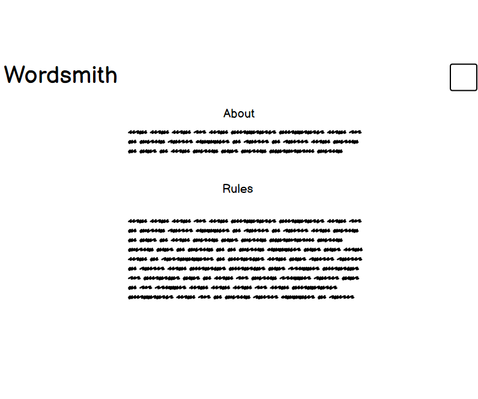

# Wordsmith

## Introduction
Wordsmith is a website built in Django using Python, JavaScript, CSS and HTML. It allows the user to share in the love of writing stories by giving them the opportunity to create their own short stories for others to read as well as read other short stories other users have posted.

They can give their story a heading, a blurb (content on the back of a book), a book cover and of course the content. You can edit your own stories as well as delete them if you wish.

[View the live website on Heroku](https://wordsmith-fafcef7f3870.herokuapp.com/)

## Table of Contents
* [User Experience Design (UX)](#UX)
    * [The Strategy Plane](#The-Strategy-Plane)
        * [Site Goals](#Site-Goals)
        * [Epics](#Epics)
        * [User Stories](#User-Stories)
    * [The Scope Plane](#The-Scope-Plane)
    * [The Structure Plane](#The-Structure-Plane)
        * [Opportunities](#Opportunities)
    * [The Skeleton Plane](#The-Skeleton-Plane)
        * [Wireframes](#Wireframe-mockups)
        * [Database Schema](#Database-Schema)
    * [The Surface Plane](#The-Surface-Plane)
* [Features](#features)
* [Future Enhancements](#future-enhancements)
* [Technologies Used](#technologies-used)
* [Testing](#testing)
* [Deployment](#deployment)
* [Credits](#credits)

## UX
### The Strategy Plane
*  Wordsmith is intended to be a site for users to create their own short stories for them to express themselves and share them for others to read. The user experience and design is to imply simplicity so that the users are not overloaded with information and get to the core of just creating, reading and enjoying the experience Wordsmith has to offer.

##### The Sites Ideal User
* A creative writer looking to share their own stories
* Someone who wants to enjoy reading short stories 
* A creative writer who wants to enjoy the art od story creation

#### Site Goals

* To provide users a place to create and edit their own stories for others to read
* To provide users a place to read other short stories

#### Epics

4 Epics were created which were then further developed into 18 User Stories. The details on each epic, along with the user stories linked to each one can be found in the project kanban board [here](https://github.com/users/SerJosh/projects/6/views/1)

1. Initial Django Setup [#1](https://github.com/SerJosh/wordsmith/issues/1)
2. User Account [#4](https://github.com/SerJosh/wordsmith/issues/4)
3. User Short Stories [#14](https://github.com/SerJosh/wordsmith/issues/14)
4. Enhancing website design [#19](https://github.com/SerJosh/wordsmith/issues/19)

### User Stories
From the Epics, 18 User stories were developed. Each story was assigned a classification of Must-have, Should-have or Could-have, I did not manage to produce any Wont-haves as I knew my time constraints and inexperience with Django would hinder me from completing any of them. Each story was also assigned user story points, based on my best estimation for the time/difficulty of completing each story. A combination of being new to story estimation, inexperience with Django and time constraints during development left me completing 31 story points from the initial total of 42. From the initial 42 story points, 8 were should-have and 8 were could-have. In an attempt to understand my scope, I did not create a vast amout of user stories initially but created essential Must-have stories to work on and after the completion of them developed some should-have or lower user stories to work with. The full list of User Stories, seperated by those completed and incompleted is available on the project [kanban board](https://github.com/users/SerJosh/projects/6/views/1).

1. Initial Django setup
	* USER STORY: Django Setup [#2](https://github.com/SerJosh/wordsmith/issues/2)
	* USER STORY: Early Deployment to Heroku [#3](https://github.com/SerJosh/wordsmith/issues/3)
	
2. User Account
	* USER STORY: Create a User Account [#5](https://github.com/SerJosh/wordsmith/issues/5)
	* USER STORY: Users must confirm their email [#6](https://github.com/SerJosh/wordsmith/issues/6)
	* USER STORY: Users can reset their password [#7](https://github.com/SerJosh/wordsmith/issues/7)
	* USER STORY: Users can view their profile [#8](https://github.com/SerJosh/wordsmith/issues/8)
	* USER STORY: Users can edit their profile [#9](https://github.com/SerJosh/wordsmith/issues/9)
	* USER STORY: Users can delete their account [#10](https://github.com/SerJosh/wordsmith/issues/10)
    * USER STORY: Users can change their password [#11](https://github.com/SerJosh/wordsmith/issues/11)
    * USER STORY: User Account Login / Logout [#12](https://github.com/SerJosh/wordsmith/issues/12)
    * USER STORY: Features restricted to signed in users [#13](https://github.com/SerJosh/wordsmith/issues/13) 

3.  USER Short Stories
	* USER STORY: Create a Short Story [#15](https://github.com/SerJosh/wordsmith/issues/15)
    * USER STORY: View short stories [#16](https://github.com/SerJosh/wordsmith/issues/16)
    * USER STORY: Edit a short story [#17](https://github.com/SerJosh/wordsmith/issues/17)
	* USER STORY: Delete a Short Story [#18](https://github.com/SerJosh/wordsmith/issues/18)

4.  Enhancing website design
	* USER STORY: Implementation of Responsive Design [#20](https://github.com/SerJosh/wordsmith/issues/20)
	* USER STORY: Utilise attractive fonts and colour scheme [#21](https://github.com/SerJosh/wordsmith/issues/21)
	* USER STORY: About page [#22](https://github.com/SerJosh/wordsmith/issues/22)

### The Scope Plane

**Features planned:**
* Stories - Users can create, read, update and delete their own stories
* Other Users Stories - Users can read other users stories
* Users can login to their account
* Users can reset their password if they forget it
* Users can logout of their account
* Users need to be registered and logged in to access story creation and read other stories
* Responsive Design - the site needs to be fully responsive to cover the wide variety of devices users may use to access Wordsmith

### The Structure Plane

User Story:

> Django Setup [#2](https://github.com/SerJosh/wordsmith/issues/2) - As a Developer, I want to set up Django and install the supporting libraries needed, so that I am ready to start development

Implementation:
* Install Django
* Install dj_database_url psycopg2
* Create a requirements.txt file
* Create the Django project – called wordsmith
* Create the first app, called stories and add it to the installed apps in the settings.py
* Create new instance in Postgres SQL and connect database to code

User Story:

> Early Deployment to Heroku [#3](https://github.com/SerJosh/wordsmith/issues/3) - As a Developer, I want to deploy the app to Heroku, so that I can confirm everything works before development of the site.

Implementation:
* Update code for deployment
* Create new Heroku app
* Connect Heroku to the PostgreSQL database
* Implement and add Secret Key to project and Heroku config var

User Story:

> Create a User Account [#5](https://github.com/SerJosh/wordsmith/issues/5) - As a user I would like to be able to create an account so that I can create and post short stories

Acceptance Criteria:
* Acceptance Criteria 1

Given that I am an unregistered user
When I am on the homepage
Then I can see a button to sign up
And, When I click on the button
Then I am taken to the user registration page

* Acceptance Criteria 2

Given that I am an unregistered user
And, I am on the user registration page
When I enter my username, email address and password
And, I click on the register button
Then The system creates me an account
And, signs me in

* Acceptance Criteria 3

Given that I have an account
And, I am signed into the account
When I have an option to write a short story
And, when I click on that option
Then I am taken to a page where I can write my short story

* Acceptance Criteria 4

Given that I am a registered user
When I am signed into my account
Then I do not see the register button 

Implementation:
* Install AllAuth
* Develop ability for users to register for a user account
* Develop a page and button in the nav bar to direct users to the registration page
* Remove the register button from the nav bar when users are logged in
* Create a User Registration form
* Create a button in the home page to create a short story directing to a create short story page

User Story:

> Users must confirm their email [#6](https://github.com/SerJosh/wordsmith/issues/6) - As a developer I can make users confirm their email so that I can keep my account secure

Acceptance Criteria:
* Acceptance Criteria 1

Given that a user wants to register
When they fill in the details in the registration page
Then they have to confirm their email

* Acceptance Criteria 2

Given that the user has confirmed their email
When they have confirmed it in their email
Then they will be able to access the site as a registered user

Implementation:
* Develop an automated email platform for users to receive email confirmations

* Include a link to the website to go back once they have confirmed

* Develop the ability to see confirmed users in the admin page

User Story:

> Users can reset their password [#7](https://github.com/SerJosh/wordsmith/issues/7) - As a user I can reset my password so that if I forget it I can still access my account

Acceptance Criteria:
* Acceptance Criteria 1

Given that I forgot by password
When I try to login with an incorrect password
Then an option is available to reset my password

* Acceptance Criteria 2

Given that I click on the link to reset my password
When I enter my email address that I used to sign up,
Then I should receive an email with instructions on how to reset my password

* Acceptance Criteria 3

Given that I have received the email to reset my password
When I follow the instructions
Then my password should be reset, or I should be able to set a new password of my choosing
And When I do not follow the instructions,
Then my password should not be reset

Implementation:
* Develop a link on the login page to take users to a reset password page
* Develop a form for users to enter their email address in order to reset their password
* Develop an email containing a link to reset the user password
* Ensure form for user to enter email address, validates the email address as belonging to current user.

User Story:

> Users can view their profile [#8](https://github.com/SerJosh/wordsmith/issues/8) - As a User I can see the details in my user profile so that I can see the information of my user account

Acceptance Criteria:
* Acceptance Criteria 1

Given that I am logged into my user account
When I can access an option to view my profile
Then my profile details are displayed

* Acceptance Criteria 2

Given that I have a user profile,
When I click on my user name on the navbar
Then I can bring up my full user profile details

Implementation:
* Develop a link for users to view their own profile when logged in
* Develop a user page that displays the users details

User Story:

> Users can edit their profile [#9](https://github.com/SerJosh/wordsmith/issues/9) - As a User I can edit my profile so that I can change my details to what I want

Acceptance Criteria:
* Acceptance Criteria 1

Given that I am logged into my account
When I am viewing my profile
Then I should be able to edit the details

* Acceptance Criteria 2

Given that I am logged into my account
When I click on the edit button on my profile page
Then I should be taken to a page to edit the details

* Acceptance Criteria 3

Given that I am not logged into my account
When I view my profile page, or anyone elses
Then I should not be able to see any user profile button

Implementation:
* Develop the ability for users to edit their own profile
* Develop a page where users can edit the information within their profile
* Add a button to a users profile that only displays when they are logged in and viewing their own profile
* Prevent users accessing any form of editing an account

User Story:

> Users can delete their account [#10](https://github.com/SerJosh/wordsmith/issues/10) - As a user I can delete my account so that I can remove my short stories and details at my request

Acceptance Criteria:
* Acceptance Criteria 1

Given that I am a registered user
When I navigate to my account
Then I have an option to delete my account

* Acceptance Criteria 2

Given that I am a registered user viewing my account details
When I click on the option to delete my account
Then I am requested to confirm the request

* Acceptance Criteria 3

Given that I am a registered user viewing my account details
When I click on the option to delete my account
When I confirm the request
Then my account and the short stories that I have created are deleted

* Acceptance Criteria 4

Given that I am a registered user
When I delete my account
Then I should receive confirmation of the account deletion

Implementation:
* On the user account page provide the user with a button to delete their account
* Develop a request confirmation process to confirm the deletion request before it happens
* When the deletion request is confirmed - delete the user account and associated stories
* Develop a confirmation to the user to show them that the user account and stories were delete

User Story:

> Users can change their password [#11](https://github.com/SerJosh/wordsmith/issues/11) - As a User I can change my password so that I can keep my account secure

Acceptance Criteria:
* Acceptance Criteria 1

Given that I am a registered User, logged in to my account
When I navigate to the edit profile page
Then I have the option to change my password

* Acceptance Criteria 2

Given that I am logged in to my account
When I change my password
Then I receive an email confirming my password has been changed

* Acceptance Criteria 3

Given that I am logged into my account
When I click the change password link
Then I am taken to the change password form
When I correctly complete the form
And, press submit
Then My password is changed to the new value
And, I receive confirmation on the screen of the change.

Implementation:
* Develop a form for users to change their password

* Include a link to the form on the edit profile page to change password – this link should only be visible if the user is logged in
* Develop form validation to ensure that the password entered meets the requirements
* Develop a feedback notification mechanism to provide users with feedback on the successful, or failure of the password change
* Develop an automated email to the user providing additional confirmation that the password was successfully changed

User Story:

> User Account Login / Logout [#12](https://github.com/SerJosh/wordsmith/issues/12) - As a User I can login or logout of my account so that I can keep my account secure 

Acceptance Criteria:
* Acceptance Criteria 1

Given that I am a registered user, who is not logged in
When I navigate to the sign in page
And, I enter my credentials correctly and press sign in
Then I am signed into my account

* Acceptance Criteria 2

Given that I am a registered user, who is currently logged in
When I click on the sign out link
Then I am signed out of my account

* Acceptance Criteria 3

Given that I am a registered user, who has signed out of my account
When I use the browser navigation buttons such as back button
Then I can not access information which requires me to be signed in

Implementation:
* Develop the ability for users to sign into their account
* Develop a sign in form to capture user sign in details
* Develop form validation to ensure the data is correct
* Develop a link for users to sign out of their account – should be accessible from all pages (nav bar), user account section
* Develop a redirect so if a user signs out whilst on a page requiring a user to be logged in, it redirects them appropriately.

User Story:

> Features restricted to signed in users [#13](https://github.com/SerJosh/wordsmith/issues/13) - As a Site Owner I can restrict some features of the site registered users have access to so that it encourages people to sign up to the site

Acceptance Criteria:
* Acceptance Criteria 1

Given that a user is not registered or signed in,
When they want to create a short story
Then they do not have the ability to create a short story

* Acceptance Criteria 2

Given that a user is not registered or signed in,
When they view other short stories
Then they are unable to provide an upvote or comment

* Acceptance Criteria 3

Given that a user is not registered or signed in,
When they encounter functionality that requires them to be signed in
Then they are presented with a login or register button.

Implementation:
* Develop restrictions to user access to create short story functionality
* Develop restrictions to reading other short stories

User Story:

> Create a Short Story [#15](https://github.com/SerJosh/wordsmith/issues/15) - As a User I can create short stories so that I can enjoy writing and capture my own work on a platform

Acceptance Criteria:
* Acceptance Criteria 1

Given that I am a logged in user
When I navigate to the create short story section
Then I have the option to create a short story

* Acceptance Criteria 2

Given that I have created a short story as a logged in user
When I save the completed short story
Then it is available to view

Implementation:
* Develop a model for a short story record
* Connect the form to the short story model to create a new short story record
* Develop the ability to create the record once the short story has been completed
* Develop validation for the short story form to ensure correct information is included

User Story:

> View short stories [#16](https://github.com/SerJosh/wordsmith/issues/16) - As a user I can view all my short stories so that I can see all of what I have created

Acceptance Criteria:
* Acceptance Criteria 1

Given that I am a user on the site and logged in
When I am on the home page
Then I am presented with a list of the short stories I have created

* Acceptance Criteria 2

Given that I am a user on the site
When I click on a short story I have created
Then I am presented with the short story on display

Implementation:
* Display short stories created on home page when logged in
* Develop a button to view the short story
User Story:

> Edit a short story [#17](https://github.com/SerJosh/wordsmith/issues/17) - As a user I can edit a short story that I have created so that I can correct any mistakes I may have made, or add/improve it

Acceptance Criteria:
* Acceptance Criteria 1

Given that I am a registered user who has created a short story
When I navigate to that short story
Then I have the option to edit the short story

* Acceptance Criteria 2

Given that I am a registered user who has created a short story
When I navigate to that short story, and click the option to edit the short story
Then I am able to edit the details of the short story

* Acceptance Criteria 3

Given that I am a registered user who has created a short story
When I navigate to the short story, click the option to edit the details
And When I have edited the details of the short story
Then I have the option to save the changes

Implementation:
* Develop an edit short story button for logged in users on the short story they have created
* Develop an edit short story page that allows the user to edit the short story
* Develop a save changes button to allow the user to save any changes they made to the short story.

User Story:

> Delete a Short Story [#18](https://github.com/SerJosh/wordsmith/issues/18) - As a user I can delete a short story that I have created so that I can remove it from the site

Acceptance Criteria:
* Acceptance Criteria 1

Given that I am a registered user who is logged in, and has created a short story
When I navigate to the short story that I would like to delete
Then I have the option to delete the short story

* Acceptance Criteria 2

Given that I am a registered user who is logged in, has created a short story and I am viewing the short story I wish to delete
When I click the delete short story button
Then I receive a confirmation window to confirm that I really want to delete the short story

* Acceptance Criteria 3

Given that I am a registered user who is logged in, has created a short story, navigated to that short story and clicked on the delete short story button
When the confirmation window appears and I confirm the deletion
Then the short story is deleted from the system

Implementation:
* Develop a delete short story button that appears on the short story page when the logged in user is the short story author
* Develop a deletion confirmation window that appears when the user clicks the delete short story button
* Develop the code that deletes the short story record when the user confirms the deletion, provided that the user requesting the deletion is the author 

User Story:

> Implementation of Responsive Design [#20](https://github.com/SerJosh/wordsmith/issues/20) - As a user I can easily navigate and view content so that I can use any device, no matter what the screen size

Acceptance Criteria:
* Acceptance Criteria 1

Given that the user is visiting the site
When the user is using a different device
Then the website automatically adjusts its content to accommodate for the screen size

Implementation:
* Use media queries to make content responsive up to 325px
* When needed use bootstrap to make content responsive
* Test responsive content on mobile phone

User Story:

> Utilise attractive fonts and colour scheme [#21](https://github.com/SerJosh/wordsmith/issues/21) - As a user I can visit a website that is enterprising and easy on the eye so that when I interact with the site, it is easy and enjoyable

Acceptance Criteria:
* Acceptance Criteria 1

Given that the user visits the website
When the user sees the display of text and colour scheme
Then the user will want to stay as the display is engaging, simplistic, creative and easy on the eye

Implementation:
* choose fonts for headings and text that is original and easy to read
* implement engaging background
* space content so it is easy to understand

User Story:

> About page [#22](https://github.com/SerJosh/wordsmith/issues/22) - As a user I can read about the website so that I know what the website is about, and understand what it it can do

Acceptance Criteria:
* Acceptance Criteria 1

Given that i am a new user
When i enter the site
Then i can access more information about the website

* Acceptance Criteria 2

Given that i am a user
When I am signed in the site
Then I can still read about the website

Implementation:
* make an accessible page when user is not logged in

* make an accessible page when a user is logged in

#### Opportunities

Arising from user stories
| Opportunities | Importance | Viability / Feasibility
| ------ | :------: | :------: |
| ** Provide users the ability to create an account ** | 5 | 5 |
| ** Provide users the ability to create short stories ** | 5 | 5 |
| ** Provide users the ability to edit short stories ** | 5 | 5 |
| ** Provide users the ability to view short stories ** | 5 | 5 |
| ** Provide users the ability to delete short stories ** | 5 | 5 |
| ** Provide users the ability to edit their account ** | 4 | 3 |
| ** Provide users the ability to view other accounts ** | 3 | 3 |
| ** Provide users the ability to delete their account ** | 4 | 4 |
| ** Provide users the ability to access the site on any device ** | 5 | 5 |

### The Skeleton Plane
#### Wireframe mock-ups

[Balsamiq](https://balsamiq.com/) has been used to mockup the website and display the placement of the different elements whitin the pages. Obviously, there is now a difference from the mockup to the finished website as new inspirations occurred to me whilst working on the project, the most notable would be removing the global stories and own stories page, and combining them.

index.html unauthenticated 
create_story.html 
index.html authenticated 
view_story.html 
Planned Global Stories 
about.html 

#### Database Schema

Two custom models were originally predicted to be required when building the site. The intention to utilise AllAuth for the user authentication system, which utilises the built in Django User Model removed the need to build a custom User model, however I originally wanted a User Profile, but time constraints prvented me from implementing this. In order for the users to create Short stories a custom Story model was developed, but I could not implement Date, Genre and Posted due to time constraints. The models in the app reflect the true field choice.

### The Surface Plane

#### Design

For the design, I wanted it to be simplistic yet creative as the site encourages you to be creative with your contant. I applied book related backgrounds with a theme of a more fantasy like nature. I tried to not make the pages too busy with content so that everything was easy to find and understand.

##### Typography 
IM Fell English SC, Cairo and sans serif fonts were chosen. IM Fell English SC for the headings, with its typewrite like text to add to the theme of story creation, Cairo for the paragraph content as it is modern and easy to read, and sans serif for a backup font if the others do not load. 

##### Images
Three main images were used for the background of the pages, and a placeholder book image supplied for users who do not upload an image (cover) to their short story.

This image was used in the index page, authenticated or unauthenticated.

This image was used for all allauth template pages

This image was used for the create story, edit story and about pages

This placeholder image was used for a placeholder for stories without images

## Features

#### Index.html Unauthenticated

#### Navigation Bar

#### Footer

